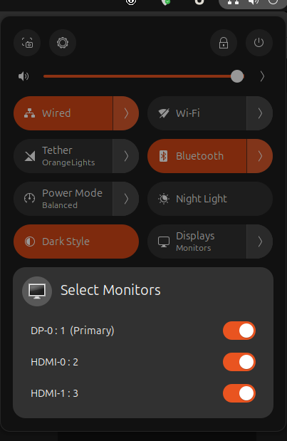

# Mony Monitors

## Overview

Mony Monitors is a gnome extension allowing users to toggle display's ON/OFF. As more features will be added soon.

## Features

- Toggle monitors on and off
- Change Orientation (TBD)
- Permanent or Temp settings

## Live Link

- TBD, waiting on approval.

## Usage

Once the application is running, you can access it via top right gnome quick settings panel.

## Contact -- HELP ME TEST

Share your logs if you encounter issues/bugs
`journalctl -f -o cat /usr/bin/gnome-shell`

For any questions or feedback, please contact us at monymonitor@gmail.com
